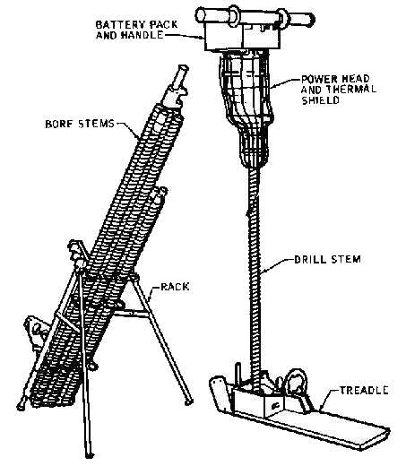
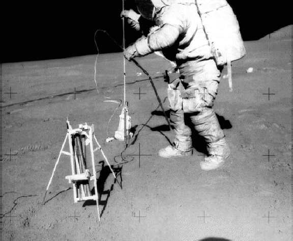

.. _Apollo Lunar Surface Drill:

Apollo Lunar Surface Drill
==========================

    :ref:`Apollo Lunar Surface Drill`. Źródło: :cite:`Knudson2013`

    Narzędzia :ref:`Apollo Lunar Surface Drill` użyto w celu wykonywania otworów wiertniczych na powierzchni Księżyca. Do otworów wprowadzano sondy dla eksperymentów :ref:`Heat Flow Experiment`, :ref:`Neutron Probe Experiment`. Z wydrążonych otworów pobierano również próbki geologiczne. Źródło: :cite:`Knudson2013`
