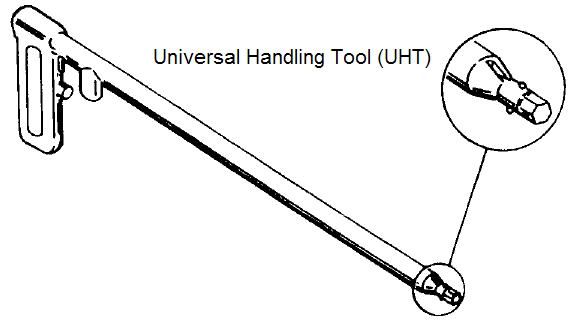
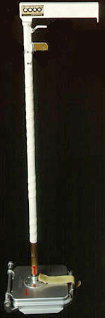
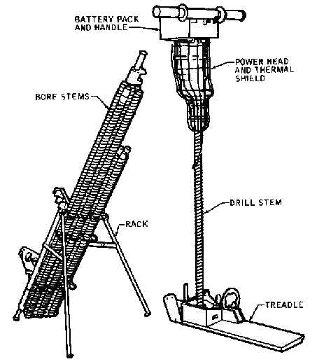
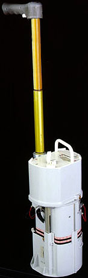
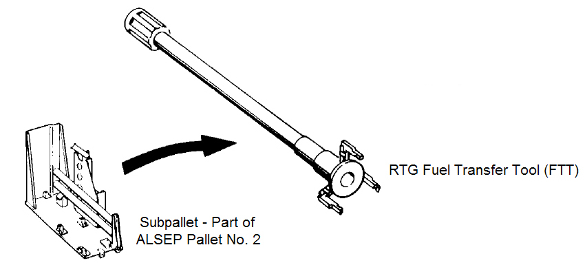
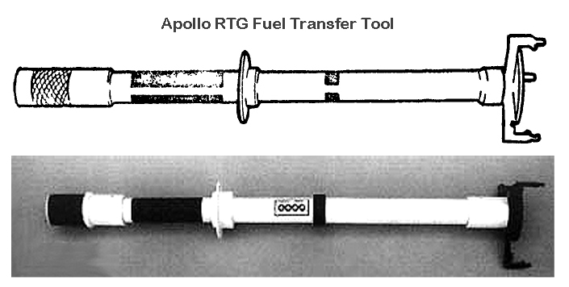

*********
Narzędzia
*********

Universal Handling Tool
=======================

    Źródło: :cite:`Knudson2013`

    Źródło: :cite:`Knudson2013`

Apollo Lunar Surface Drill
==========================

    Źródło: :cite:`Knudson2013`

.. figure:: img/equipment-ALSD-photo.jpg
    :name: figure-equipment-ALSD-photo

    Narzędzia ALSD użyto w celu wykonywania otworów wiertniczych na powierzchni Księżyca. Do otworów wprowadzano sondy dla eksperymentów :ref:`Heat Flow Experiment`, :ref:`Neutron Probe Experiment`. Z wydrążonych otworów pobierano również próbki geologiczne. Źródło: :cite:`Knudson2013`

Apollo Lunar Surface Close-up Camera (ALSCC)
============================================

    Źródło: :cite:`Knudson2013`

RTG Fuel Transfer Tool (FTT)
============================

    Źródło: :cite:`Knudson2013`

    Źródło: :cite:`Knudson2013`

RTG Cask Dome Removal Tool (DRT)
================================
.. figure:: img/equipment-RTG-DRT.jpg
    :name: figure-equipment-RTG-DRT

    Źródło: :cite:`Knudson2013`
