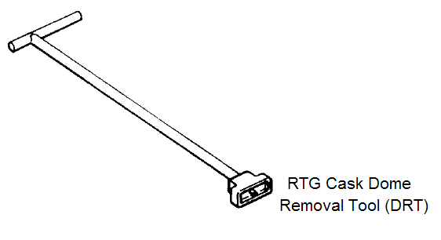
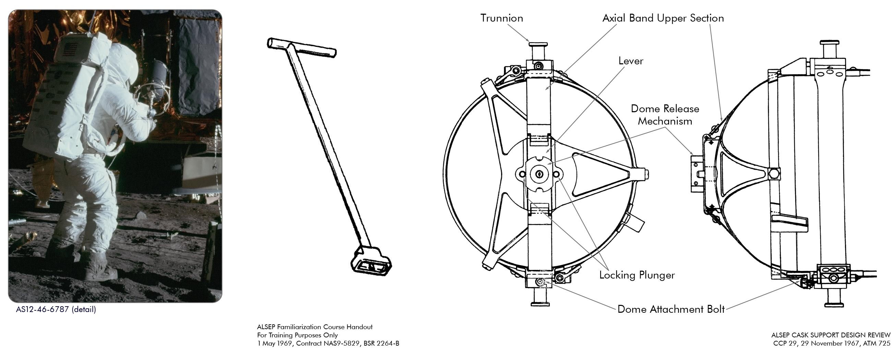

*************************************************
Narzędzia używane do prac na powierzchni Księżyca
*************************************************

.. _Universal Handling Tool:

Universal Handling Tool
=======================
.. figure:: img/equipment-UHT-diagram.jpg
    :name: figure-equipment-UHT-diagram

    :ref:`Universal Handling Tool`. Źródło: :cite:`Knudson2013`

.. figure:: img/equipment-UHT-photo1.jpg
    :name: figure-equipment-UHT-photo1

    :ref:`Universal Handling Tool`. Źródło: :cite:`Knudson2013`

.. _Apollo Lunar Surface Drill:

Apollo Lunar Surface Drill
==========================
.. figure:: img/equipment-ALSD-diagram.jpg
    :name: figure-equipment-ALSD-diagram

    :ref:`Apollo Lunar Surface Drill`. Źródło: :cite:`Knudson2013`

.. figure:: img/equipment-ALSD-photo.jpg
    :name: figure-equipment-ALSD-photo

    Narzędzia :ref:`Apollo Lunar Surface Drill` użyto w celu wykonywania otworów wiertniczych na powierzchni Księżyca. Do otworów wprowadzano sondy dla eksperymentów :ref:`Heat Flow Experiment`, :ref:`Neutron Probe Experiment`. Z wydrążonych otworów pobierano również próbki geologiczne. Źródło: :cite:`Knudson2013`

.. _Apollo Lunar Surface Close-up Camera:

Apollo Lunar Surface Close-up Camera (ALSCC)
============================================
.. figure:: img/equipment-ALSCC-photo.jpg
    :name: figure-equipment-ALSCC-photo

    :ref:`Apollo Lunar Surface Close-up Camera`. Źródło: :cite:`Knudson2013`

.. _RTG Fuel Transfer Tool:

RTG Fuel Transfer Tool (FTT)
============================
.. figure:: img/equipment-RTG-FFT-diagram.jpg
    :name: figure-equipment-RTG-FFT-diagram

    :ref:`RTG Fuel Transfer Tool`. Źródło: :cite:`Knudson2013`

.. figure:: img/equipment-RTG-FTT-photo.jpg
    :name: figure-equipment-RTG-FTT-photo

    :ref:`RTG Fuel Transfer Tool`. Źródło: :cite:`Knudson2013`

.. _RTG Cask Dome Removal Tool:

RTG Cask Dome Removal Tool (DRT)
================================

    :ref:`RTG Cask Dome Removal Tool`. Źródło: :cite:`Knudson2013`

    :ref:`RTG Cask Dome Removal Tool`. Źródło: :cite:`Jones1995`
