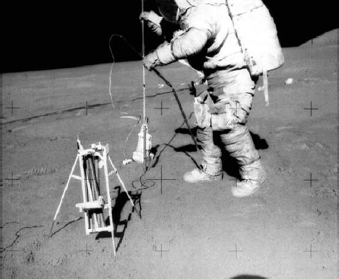

*********
Narzędzia
*********

Universal Handling Tool
=======================
.. figure:: img/equipment-UHT-diagram.jpg
    :name: figure-equipment-UHT-diagram

    Źródło: :cite:`Knudson2013`

.. figure:: img/equipment-UHT-photo1.jpg
    :name: figure-equipment-UHT-photo1

    Źródło: :cite:`Knudson2013`

Apollo Lunar Surface Drill
==========================
.. figure:: img/equipment-ALSD-diagram.jpg
    :name: figure-equipment-ALSD-diagram

    Źródło: :cite:`Knudson2013`

    Narzędzia ALSD użyto w celu wykonywania otworów wiertniczych na powierzchni Księżyca. Do otworów wprowadzano sondy dla eksperymentów :ref:`Heat Flow Experiment`, :ref:`Neutron Probe Experiment`. Z wydrążonych otworów pobierano również próbki geologiczne. Źródło: :cite:`Knudson2013`

Apollo Lunar Surface Close-up Camera (ALSCC)
============================================
.. figure:: img/equipment-ALSCC-photo.jpg
    :name: figure-equipment-ALSCC-photo

    Źródło: :cite:`Knudson2013`

RTG Fuel Transfer Tool (FTT)
============================

    Źródło: :cite:`Knudson2013`

.. figure:: img/equipment-RTG-FTT-photo.jpg
    :name: figure-equipment-RTG-FTT-photo

    Źródło: :cite:`Knudson2013`

RTG Cask Dome Removal Tool (DRT)
================================
.. figure:: img/equipment-RTG-DRT.jpg
    :name: figure-equipment-RTG-DRT

    Źródło: :cite:`Knudson2013`
