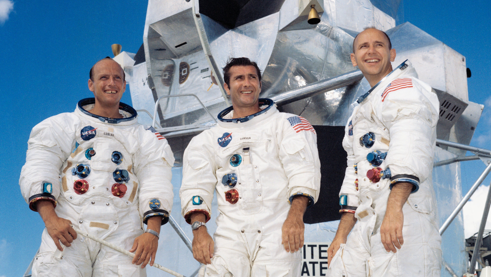
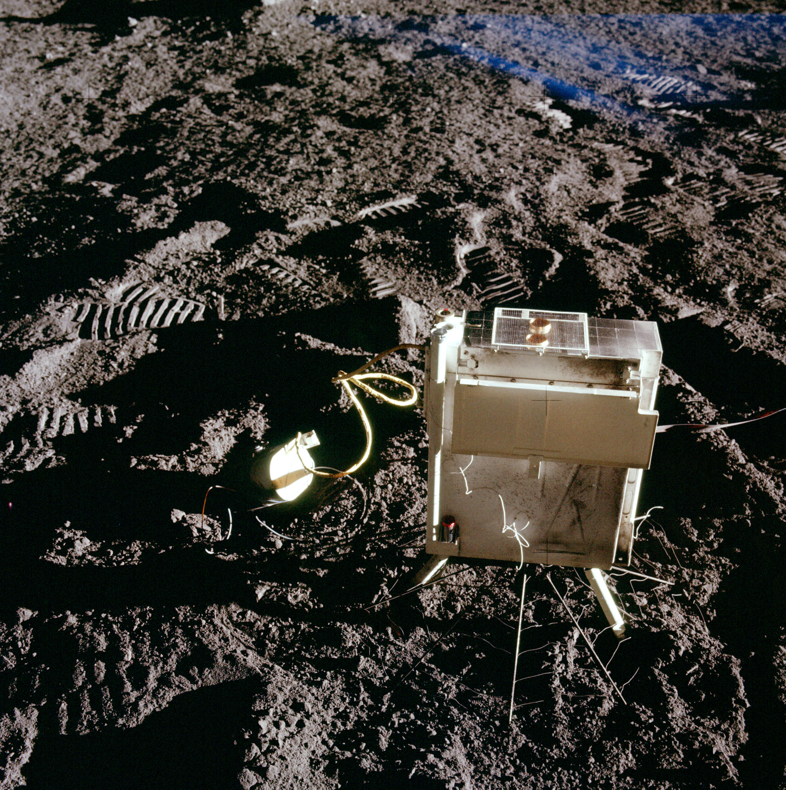

.. _Apollo 12:

*********
Apollo 12
*********

Charakterystyka misji
=====================
Celem misji Apollo 12 była wizyta miejsca lądowania sondy *Surveyor 3*, która wylądowała na powierzchni w kwietniu 1967 roku. Lądowanie podczas tej misji było jednym z najbardziej precyzyjnych :cite:`Calio1970`.

Apollo 12 było pierwszą misją podczas, której wykonano eksperymenty z pakietu :term:`ALSEP`.

Podstawowe informacje dotyczące misji
=====================================
.. csv-table:: Wybrane informacje dotyczące parametrów misji Apollo 12 :cite:`Garber2019`, :cite:`Johnston1975`, :cite:`Orloff2000`.
    :stub-columns: 1
    :file: data/apollo12-info.csv

Załoga
======
.. csv-table:: Lista członków załogi głównej i zapasowej dla misji Apollo 12 :cite:`Johnston1975`.
    :file: data/apollo12-crew.csv
    :header-rows: 1

    Załoga misji Apollo 12. Od lewej astronauci: Conrad, Gordon, Bean

Miejsce lądowania
=================
.. figure:: img/apollo12-map.png
    :name: figure-apollo12-map

    Mapa lokacji lądowania i rozstawienia eksperymentów naukowych podczas misji Apollo 12. Źródło: NASA/USGS/LPI/ASU, :cite:`Lindsay2008`, :cite:`Apollo12PressKit`.

Eksploracja powierzchni Księżyca
================================
.. csv-table:: Harmonogram spacerów kosmicznych na powierzchni księżyca podczas misji Apollo 12 :cite:`LPI2019`.
    :file: data/apollo12-eva.csv
    :header-rows: 1

Lista eksperymentów
===================
W trakcie misji Apollo 12 wykonano następujące eksperymenty :cite:`Lindsay2008` :cite:`Meyer2009`, :cite:`LPI2019`, :cite:`Apollo12PressKit`, :cite:`Calio1970`:

    #. :ref:`Cold Cathode Ion Gauge`
    #. :ref:`Lunar Dust Detector`
    #. :ref:`Lunar Surface Magnetometer`
    #. :ref:`Passive Seismic Experiment`
    #. :ref:`Suprathermal Ion Detector Experiment`
    #. :ref:`Solar Wind Composition Experiment`
    #. :ref:`Solar Wind Spectrometer`

.. figure:: img/apollo12-setup.jpg
    :name: figure-apollo12-setup

    Mapa schematyczna rozstawienia eksperymentów naukowych podczas misji Apollo 12. Źródło: :cite:`ImageProjectApolloArchive`.

Zdjęcia eksperymentów na powierzchni
====================================
.. figure:: img/apollo12-LSM.jpg
    :name: figure-apollo12-LSM

    :ref:`Lunar Surface Magnetometer`. Źródło: :cite:`ImageProjectApolloArchive`.

.. figure:: img/apollo12-PSE.jpg
    :name: figure-apollo12-PSE

    :ref:`Passive Seismic Experiment`. Źródło: :cite:`ImageProjectApolloArchive`.

    :ref:`Suprathermal Ion Detector Experiment` / :ref:`Cold Cathode Ion Gauge`. Źródło: :cite:`ImageProjectApolloArchive`.

.. figure:: img/apollo12-SWS.jpg
    :name: figure-apollo12-SWS

    :ref:`Solar Wind Spectrometer`. Źródło: :cite:`ImageProjectApolloArchive`.

.. todo::
    Field Geology Investigations

    The scientific objectives of the Apollo Field Geology Investigations are to determine the composition of the Moon and the processes which shape its surfaces. This information will help to determine the history of the Moon and its
    relationship to the Earth. The early investigations to understanding the nature and origin of the Mare are limited by mission constraints. Apollo 11 visited the Sea of Tranquility (Mare Tranquillitatis), Apollo 12 will study the Ocean of Storms (Oceanus Procellarum). The results of these studies should help establish the nature of Mare-type areas.

    Geology investigations of the Moon actually began with the telescope. Systematic geology mapping began ten years ago with a team of scientists at the U.S. Geological Survey. Ranger, Surveyor and especially Lunar Orbiter data enormously increased the detail and accuracy of these studies. The Apollo 11 investigations represent another enormous advancement in providing new evidence on the Moon's great age, its curious chemistry, the surprisingly high density of the lunar surface material.

    On Apollo 12, almost the entire second EVA will be devoted to the Field Geology Investigations and the collection of documented samples. The sample locations will be photographed before and after sampling. The astronauts will carefully describe the setting from which the sample is collected. Samples will be taken along the rays of large craters. It is this material, ejected from great depth, which will provide evidence on the nature of the lunar interior. In addition to specific tasks, the astronauts will be free to photograph and sample phenomena which they judge to be unusual, significant, and interesting. The astronauts are provided with a package of detailed photo maps which they will use for planning traverses. Photographs will be taken from the LM window. Each feature or family of features will be described, relating to features on the photo maps. Areas and features where photographs should be taken and representative samples collected will be marked on the maps as determined primarily by the astronauts but with inputs from Earth-based geologists.

    The Earth-based geologists will be available to advise the astronauts in real-time and will work with the data returned, the photos, the samples of rock and the astronauts' observations to reconstruct here on Earth the astronauts' traverse on the Moon.

    If landing accuracy permits, the Apollo 12 astronauts plan to visit the Surveyor III spacecraft. Analytical results of lunar samples collected from the Surveyor III site will be compared to chemical analysis made by the Surveyor alpha particle back-scatter experiment.

    The Field Geological Investigations are the responsibility of Dr. Eugene Shoemaker, Principal Investigator, California Institute of Technology. His Co-Investigators are Aaron Waters, University of California (Santa Cruz); E. M. Goddard, University of Michigan; H. H. Schmitt, Astronaut; T. H. Foss, NASA; J. J. Rennilson, Jet Propulsion Laboratory; Gordon Swann, USGS; M. H. Hait, USGS; E. H. Holt, USGS; and R. M. Batson, USGS.

    Each astronaut will carry a Lunar Surface Camera (a modified 70 mm electric Hasselblad). The camera has a 60 mm Biogon lens, with apertures ranging from f/5.6 to f/45. Its focus range is from 3 ft to infinity, with detents at the 5 foot, 15 foot and 74 foot settings. The camera system incorporates a rigidly installed glass plate bearing a reference grid immediately in front of the image plane. A polarizing filter attached to the lens of one of the cameras can be rotated in 45°increments for light polarizing studies. On the first EVA, each magazine will carry 160 frames of color film. For the second EVA, each film magazine will contain 200 frames of thin-base black and white film.

    A gnomon, used for metric control of near field (less than 10 feet) stereoscopic photography, will provide angular orientation relative to the local vertical. Information on the distances to objects and on the pitch, roll, and azimuth of the camera's optic axis are thereby included in each photograph. The gnomon is a weighted tube suspended vertically on a tripod supported gimbal. The tube extends one foot above the gimbal and is painted with a gray scale in bands one centimeter wide. Photogrammetric techniques will be used to produce three-dimensional models and maps of the lunar surface from the angular and distance relationship between specific objects recorded on the film.

    The Apollo black and white surface television camera has two resolution modes (320 scan lines/frame and 1280 scan lines/frame) and two respective scanning modes (10 frames/second and 0.625 frames/second). With the TV camera mounted on a tripod on the lunar surface, the astronauts will be able to conduct the early portion of their traverse within the field of view of the lunar daytime lens. This surveillance will permit Earth-bound advisors to assist in any up-date of pre-mission plans for the lunar surface operations as such assistance is required.

    The 16 mm Data Acquisition Camera will provide time- sequence coverage from within the LM. It can be operated in several automatic modes, ranging from 1 frame/second to 24 frames/sec. Shutter speeds,!which are independent of the frame rates, range from 1/1000 second to 1/60 second. Time exposures are also possible. While a variety of lenses is provided, the 18 mm lens will be used to record most of the geological activities in the 1 frame/sec mode.

    The Lunar Surface Close-up Camera will be used to obtain high resolution stereoscopic photographs of the lunar sur- fact to provide fine scale, information on lunar soil and rock textures. Up to 100 stereo pairs can be exposed on the pre loaded roll of 35 mm color film. The handle grip enables the astronaut to operate the camera from a standing position. The film drive and electronic flash are battery-operated.

    The camera photographs a 3"x3" area of the lunar surface. Geological sampling equipment includes tongs, scoop, hammer, and core tubes. A 24-inch extension handle is provided for several of the tools to aid the astronaut in using them without kneeling.

    Sample return containers (SRC) have been provided for return of up to 40 pounds each of lunar material for Earth- based analysis. The SRC's are identical to the ones used on the Apollo 11 mission. They are machined from aluminum forgings and are designed to maintain an internal vacuum during the outbound and return flights. The SRC's will be filled with representative samples of lunar surface material, collected and separately bagged by the astronauts on their traverse and documented by verbal descriptions and photography. Subsurface samples will be obtained by using drive tubes 16 inches long and one inch in diameter. A few grams of material will be preserved under lunar vacuum conditions in a special environmental sample container. This container will be opened for analysis under vacuum conditions equivalent to that at the lunar surface.
