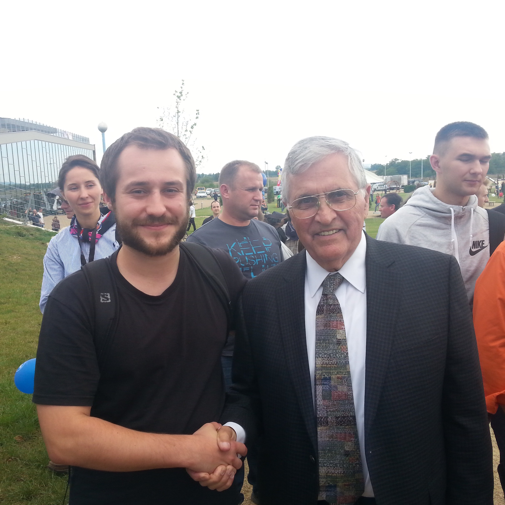

******
Metody
******

#. Analiza publikacji naukowych dotyczących badań geofizycznych Księżyca
#. Synteza materiałów historycznych udostępnionych przez NASA
#. Analiza planu lotu misji Apollo 11
#. Analiza jakościowa publicznych danych
#. Wywiad środowiskowy w branży kosmicznej zajmującej się eksploracją Księżyca
#. Przegląd literatury przedmiotu i podmiotu
#. Przegląd bibliografii astronautów programu Apollo
#. Kontakt z astronautami, którzy brali udział w programie *Apollo*
#. Kontakt z astronautą-geologiem, który prowadził badania na Księżycu (:numref:`figure-meeting-schmitt-matt`)
#. Synteza informacji zgromadzonych w muzeach poświęconych programowi *Apollo*

    Zdjęcie okolicznościowe zrobione podczas spotkania autora publikacji z astronautą-geologiem *Harrison Hagan "Jack" Schmitt* uczestnikiem wyprawy *Apollo 17*.
