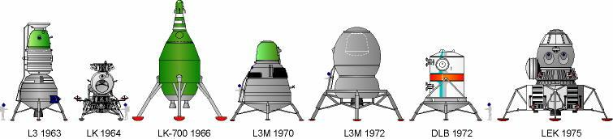

*********************************
Rys historyczny lotów kosmicznych
*********************************

Programy kosmiczne były prowadzone głównie przez dwa państwa USA i Federację Rosyjską (uprzednio Związek Socjalistycznych Republik Radzieckich). ZSRR był inicjatorem współpracy międzynarodowej. W ramach programu Interkosmos polecieli pierwsi kosmonauci niebędący obywatelami wyżej wymienionych mocarstw, a generał Hermaszewski został pierwszym polakiem, który tego dokonał.

Podczas selekcji kosmonauci i astronauci wybierani byli głównie ze względu na doświadczenie w pilotażu, chociaż pojawiały się również grupy osób z innych specjalności tj. inżynieria, nauka, medycyna jak również nauczyciele.

Wraz z rozwojem technologicznym pozwalającym na autonomiczne prowadzenie statków kosmicznych oraz ich dokowanie, oraz wraz ze zwiększającą się liczbą startów, zwiększaniem stabilizacji i bezpieczeństwa lotów jak i pobytu w kosmosie nacisk na doświadczenie kandydata jako pilota maleje. Chociaż to wciąż wysoko cenieni specjaliści, to ilość badań, ich złożoność oraz specyfika promuje profil kandydatów z wykształceniem naukowym lub inżynieryjnym. Jednocześnie na uwagę zasługuje fakt, iż w większości przydziałów do misji, osoby które udawały się w kosmos były szkolone do prowadzenia badań wychodzących poza zakres specjalizacji danego astronauty.

Wyścig kosmiczny i początki załogowych lotów kosmicznych
========================================================
Po drugiej wojnie światowej wyścig zbrojeń przerodził się w tzw. zimną wojnę pomiędzy Stanami Zjednoczonymi Ameryki i Związkiem Socjalistycznych Republik Radzieckich. Za oficjalną datę rozpoczęcia wyścigu kosmicznego (ang. *Space Race*) przyjmuje się dzień 2 sierpnia 1955 roku. Tego dnia Związek Radziecki odpowiedział na ogłoszoną przez rząd USA cztery dni wcześniej deklarację zamiaru wystrzelenia sztucznego satelity z okazji międzynarodowego roku geofizyki :cite:`Cadbury2006`.

Wystrzelony 4 października 1957 należący do ZSRR Sputnik został pierwszym sztucznym satelitą Ziemi. To wydarzenie zapoczątkowało serię sukcesów Związku Socjalistycznych Republik Radzieckich w kosmosie, do których należały:

- pierwsze wystrzelenie zwierzęcia (pies Łajka, 3 październik 1957),
- pierwsze bezzałogowe lądowanie na Księżycu (Luna 2, 13 września 1959) :cite:`Shelton1969`,
- wystrzelenie oraz orbitowanie pierwszego człowieka (J. Gagarin, 12 kwietnia 1961),
- pierwsza lot orbitalny trwający ponad dobę (G. Titow, 6 sierpnia 1961),
- pierwsza kobieta w kosmosie (W. Tierieszkowa, 16 Czerwiec 1963),
- pierwszy spacer kosmiczny (A. Leonow, 18 marzec 1965),
- pierwsze zwierzęta orbitujące Księżyc, które powróciły na Ziemię (Zond 5, 15 września 1968) :cite:`Siddiqi2000`.

Pierwszym zwierzęciem, które przekroczyło linię graniczną kosmosu był pies Łajka wystrzelony za pomocą rakiety Sputnik 8K71PS w kapsule Sputnik-2 :cite:`Siddiqi2000`. Ze względu na wysoką temperaturę spowodowaną uszkodzeniem i niepełnym rozczepieniem członu rakiety od satelity zwierzę zdechło po kilku godzinach od startu. Pies planowo miał żyć na orbicie 10 dni. Po 162-óch dniach (około 2000 orbit) kapsuła z martwym ciałem weszła w atmosferę i spłonęła :cite:`Harford1997`.

Pierwszym człowiekiem w kosmosie był major Jurij Gagarin (awansowany później na pułkownika). Gagarin był jednym z 20 osób, które zostały wybrane wśród pilotów wojskowych Związku Radzieckiego :cite:`Siddiqi2000`. Wg. podań świadków major wyróżniał się wytrzymałością, duchem oraz doświadczeniem. Major został wystrzelony przez Związek Radziecki 12 kwietnia 1961 w 108 minutowy lot orbitalny wokół Ziemi na pokładzie Vostok-1. Po okrążeniu Ziemi wszedł ponownie w atmosferę w tzw. krzywej balistycznej cechującej się wysokim poziomem przeciążeń działających na ciało kosmonauty. Ze względu na fakt, iż Radzieccy konstruktorzy nie dysponowali jeszcze techniką aby bezpiecznie wylądować statkiem kosmicznym na ziemi zdecydowano się na użycie fotela katapultowego i spadochronu. Na poziomie 20 000 stóp nad poziomem morza (ok. 6 tys. metrów) Gagarin katapultował się z kapsuły i bezpiecznie wrócił na powierzchnię :cite:`Lewis2010`.

Amerykańską odpowiedzią na plan wysłania człowieka w kosmos był program Mercury. W trakcie selekcji do programu wybrano siedmiu astronautów. 5 maja 1961 Alan Shepard jako pierwszy amerykanin poleciał w kosmos. 12 września 1962 - pół roku po locie Sheparda, w celu zażegnania widma porażki w kosmicznym wyścigu prezydent Stanów Zjednoczonych Ameryki J. F. Kennedy wygłosił mowę na Uniwersytecie Rice :cite:`Kennedy1962`. W trakcie przemowy Kennedy zmobilizował naród i postawił cel, aby "do końca dekady człowiek postawił nogę na Księżycu i bezpiecznie wrócił na Ziemię". Cel ten udało się zrealizować w 1969 roku, gdy amerykański astronauta Neil Armstrong stanął na naturalnym satelicie Ziemi. Do najważniejszych amerykańskich programów należą:

- project Mercury,
- project Gemini,
- project Apollo,
- project Skylab (Apollo Application),
- program Space Shuttle,
- uczestnictwo w programie ISS.

Związek Socjalistycznych Republik Radzieckich wiódł prym w tematach kosmicznych i do czasu pierwszych kroków Neila Armstronga technologia radziecka była uważana za dominującą. Programy załogowe ZSRR charakteryzowały się dużą złożonością i zróżnicowaniem. Wśród najważniejszych programów ZSRR i późniejszej Federacji Rosyjskiej można wymienić:

- program Wostok,
- program Woschod,
- program Sojuz i Progres,
- program Księżycowy (N1-L3),
- program Salut,
- program Interkosmos,
- program Buran,
- stacja kosmiczna Mir,
- uczestnictwo w programie ISS.

Ze względu na plan powrotu człowieka na Księżyc warto w szczegółach przyjrzeć się programowi Apollo oraz N1-L3. W ramach tych misji i całego cyklu przygotowania do lotów stworzone zostały mechanizmy, procedury oraz infrastruktura szkoleniowo-badawcza. Część technologii i opracowań, które w 1969 roku pozwoliły człowiekowi stanąć wciąż są aktualne i mogą być wykorzystane przy szkoleniu astronautów do przyszłych misji na inne ciała niebieskie.

Program Księżycowy (N1-L3)
==========================
ZSRR konkurował ze stanami zjednoczonymi w ramach wyścigu kosmicznego. Punktem kulminacyjnym całego Space Race miał być załogowy lot na Księżyc. W tym celu Główny Konstruktor Siergiej Pawłowicz Korolew rozpoczął pracę nad rakietą N1. W ramach programu stworzony został również moduł orbitujący (ros. *LOK - Lunniy Orbitalny Korabl*) oraz lądownik (ros. *LK - Lunniy Korabl*) przedstawiony na obrazku :numref:`figure-spacecraft-lk-models`. Rakieta N1 w przeciwieństwie amerykańskiego podejścia składała się nie z trzech a z 5 segmentów (ang. *stage*) oraz 30 silników pierwszego poziomu. Ze względu na złożoność systemu rakieta każdorazowo eksplodowała przy starcie. Po czwartym nieudanym podejściu i utracie nosiciela, zmianie geopolitycznej i przegraniu wyścigu kosmicznego Komitet Centralny Partii postanowił zamknąć program.

W 1966 roku kosmonauci zostali przydzieleni do treningów księżycowych (:numref:`table-selection-n1-l3`). Stworzono grupy, których celami były:

- Soyuz 7K-OK - kwalifikacja statków Soyuz do lotów orbitalnych (lider Gagarin),
- L1/Zond - lotów księżycowych na rakiecie Proton (lider Komarow),
- L3 - opracowanie procedur i metodyki lądowania na Księżycu (lider Leonow).

W ramach programu N1-L3 zaplanowano 18 misji. Ze względu na przewodzenie grupie opracowujących lądowanie Aleksiej Leonow miał największą szansę być nominowany do bycia pierwszym kosmonautą na Księżycu :cite:`LeonovScott2006`.

.. csv-table:: Lista kosmonautów przypisanych do grup szkoleniowych w ramach sowieckiego programu księżycowego :cite:`Kamanin2009`
    :name: table-selection-n1-l3
    :file: data/selection-n1-l3.csv
    :header-rows: 1
    :widths: 10, 90

.. csv-table:: Planowany harmonogram lotów w ramach sowieckiego programu księżycowego :cite:`Kamanin2009`
    :name: table-timeline-n1-l3
    :file: data/timeline-n1-l3.csv
    :header-rows: 1
    :widths: 10, 20, 70

    Różne prototypy lądowników księżycowych w ramach programu załogowego ZSRR. Źródło: Astronautics/Mark Wade :cite:`Wade2001`

Program Apollo
==============
Najbardziej ambitnym programem w historii astronautyki był program Apollo. W ciągu niespełna dekady udało się opracować technologię oraz procedury pozwalające człowiekowi stanąć na powierzchni Księżyca i bezpiecznie powrócić na Ziemię. Program Apollo był próbą realizacji oświadczenia prezydenta USA J. F. Kennedy'ego z 12 września 1962 roku :cite:`Kennedy1962`.

Każda z misji programu Apollo cechowała się innym zadaniem w zależności od kategorii do której była przydzielona :cite:`Ertel2007`. :numref:`table-apollo-mission-types` przedstawia typy misji oraz opis każdej z kategorii.

Krótka charakterystyka misji Apollo :cite:`Eisele2017`, :cite:`Cunningham2010`, :cite:`Cernan2000`:

- Apollo 1 - pożar przy rutynowym teście, załoga poniosła śmierć,
- Apollo 7 - pierwszy start rakiety Saturn V z astronautami w :term:`module dowodzenia <Command Module>`,
- Apollo 8 - pierwsze załogowe orbitowanie Księżyca, ikoniczne zdjęcie :term:`wschodu Ziemi <Lunar Earthrise>` przedstawiające wschód Ziemi nad Księżycem,
- Apollo 10 - pełny test do misji typu *G*, zbliżenie na 8,4 NM (15,6 km) do powierzchni Księżyca,
- Apollo 11 - pierwsze lądowanie na Księżycu, ikoniczne zdjęcie "Lunar Footprint" przedstawiające odcisk buta astronauty na powierzchni,
- Apollo 12 - najbardziej dokładne lądowanie w programie Apollo, akwizycja kamery sondy :term:`Surveyor 3`,
- Apollo 13 - wybuch zbiornika z tlenem i dramatyczna walka z czasem aby sprowadzić załogę na Ziemię,
- Apollo 14 - test pojazdu :term:`MET` na księżycu,
- Apollo 15 - pierwsze wykorzystanie pojazdu :term:`LRV`,
- Apollo 16 - pierwsza trzydniowa misja (typ *J*)
- Apollo 17 - ostatnie lądowanie na Księżycu (pierwsza misja w której brał udział naukowiec - geolog), ikoniczne zdjęcie "Blue Marble" - przedstawiający Ziemię z daleka,
- Apollo-Soyuz Test Project - ostatnia misja programu, podczas której doszło do dokowania na orbicie statków Apollo oraz Sojuz i historycznego uścisku dłoni między reprezentantami USA i ZSRR.

.. csv-table:: Typy misji w ramach programu Apollo :cite:`Ertel2007`
    :name: table-apollo-mission-types
    :file: data/apollo-mission-types.csv
    :header-rows: 1
    :widths: 5, 5, 20, 5, 20, 35

